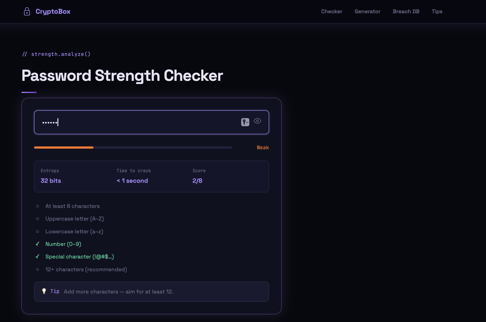
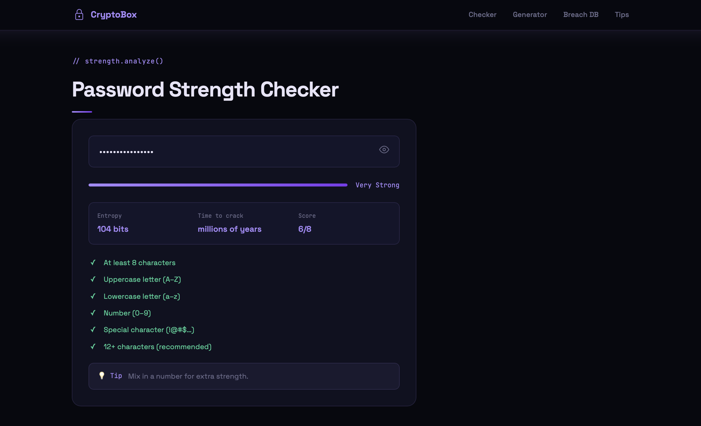
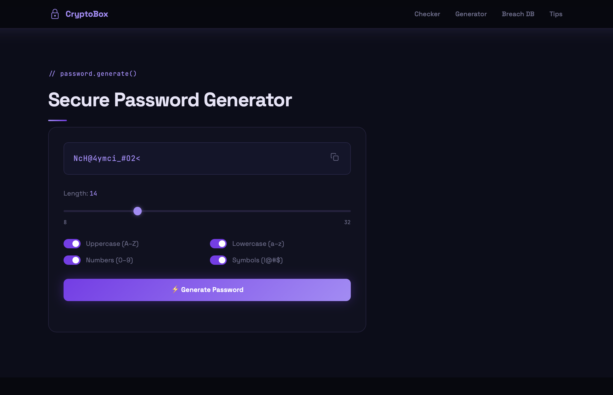
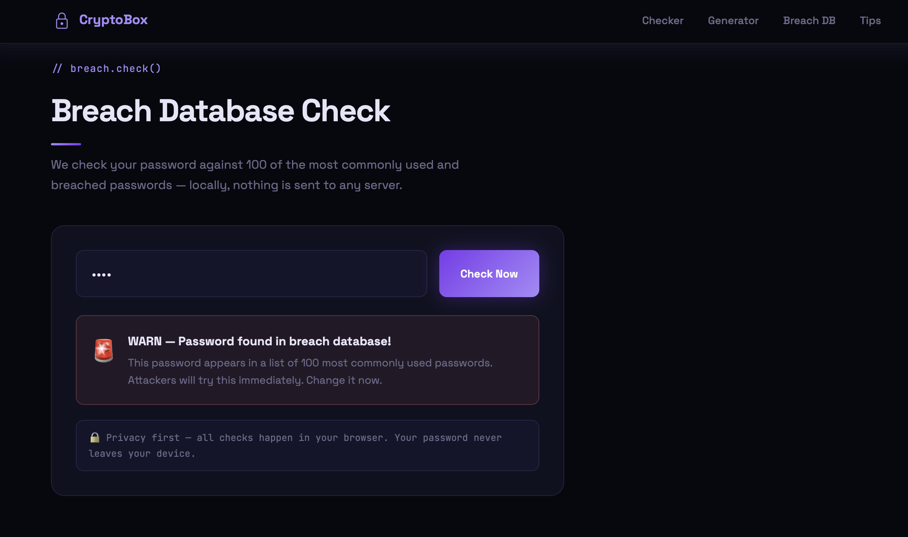
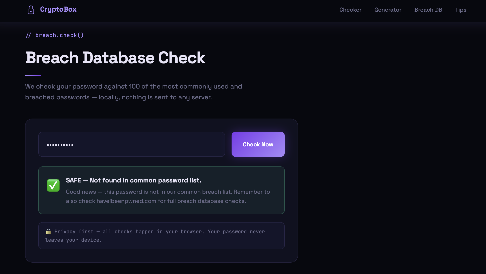

# 🔐 CryptoBox — Password Strength Checker

> **Project 2 of 4 · Cybrexa Learning Track**  
> A privacy-first password strength checker, generator, and breach detector.

[](https://your-site.netlify.app)
[](https://github.com/km23092612-jpg/Cybrexa_02_CryptoBox)
[](./SECURITY.md)
[](./SECURITY.md)

---


## 📸 Screenshots







## docs: add screenshots to README

---

## ✨ Features

### 🔍 Password Strength Checker
- Real-time strength meter (Very Weak → Very Strong)
- Entropy calculation in bits
- Time-to-crack estimate (assumes 10B guesses/sec GPU attack)
- 6-point criteria checklist (length, uppercase, lowercase, numbers, symbols, 12+ chars)
- Smart tips based on what's missing

### ⚡ Secure Password Generator
- Length slider: 8–32 characters
- Toggle: Uppercase / Lowercase / Numbers / Symbols
- Uses `crypto.getRandomValues()` — cryptographically secure (not Math.random)
- One-click copy to clipboard
- Guarantees at least one of each selected character type

### 🚨 Breach Database Check
- Checks against 100 most commonly breached passwords
- Shows WARN 🚨 or SAFE ✅
- 100% local — nothing sent to any server

### 🛡️ Security Tips Section
- Passphrase advice
- Password manager recommendations
- 2FA guidance
- Common mistakes to avoid

---

## 🔒 Privacy & Security

| Feature | Implementation |
|---|---|
| Zero server communication | All logic runs in browser JS |
| XSS Prevention | `textContent` only — never `innerHTML` on user input |
| Secure random generation | `crypto.getRandomValues()` Web Crypto API |
| No tracking | Zero analytics, zero external scripts |
| CSP Headers | Configured via `_headers` for Netlify |

---

## 🗂️ Repo Structure

```
Cybrexa_02_CryptoBox/
├── index.html      # Full single-page app
├── style.css       # Purple/violet cybersecurity theme
├── script.js       # All logic — checker, generator, breach DB
├── images/         # Screenshots
├── _headers        # Netlify security headers
├── SECURITY.md     # Vulnerability disclosure + security notes
└── README.md       # This file
```

---

## ⚙️ Setup

```bash
git clone https://github.com/km23092612-jpg/Cybrexa_02_CryptoBox.git
cd Cybrexa_02_CryptoBox
# Open index.html in browser — no build step needed
```

---

## ✅ Deliverables Checklist

- [ ] GitHub Repo: `Cybrexa_02_CryptoBox`
- [ ] Live URL (Netlify)
- [ ] 2-3 min screen recording for LinkedIn
- [ ] LinkedIn post mentioning @cybrexa with GitHub link

---

## 🏷️ Tech Stack

`HTML5` · `CSS3` · `Vanilla JavaScript` · `Web Crypto API` · `Git` · `Netlify`

---

## 📄 License

MIT © 2026 Kritika Mishra — Built as part of the [Cybrexa](https://cybrexa.in) learning track.
